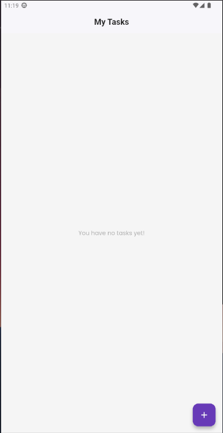
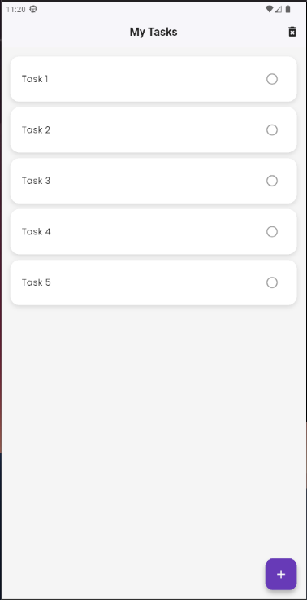
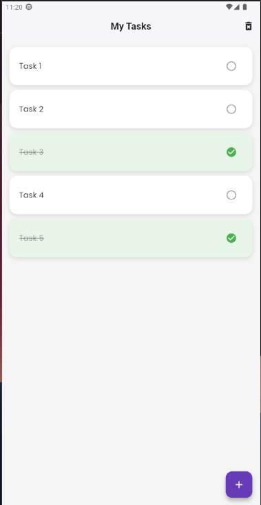
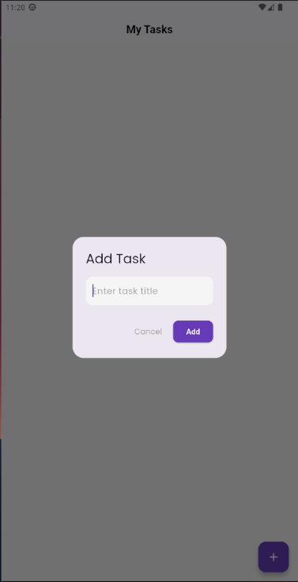

# 📝 Taskly - ToDo App

Taskly es una aplicación sencilla de tareas (ToDo) desarrollada con Flutter, diseñada para ayudarte a mantenerte organizado. Puedes agregar, marcar como completadas o eliminar tareas con una experiencia visual atractiva y animaciones suaves.

---

## 🚀 Características

- ✅ Añadir nuevas tareas.
- 🧠 Marcar tareas como completadas.
- ❌ Eliminar tareas con swipe.
- 🎨 Animaciones suaves con `animate_do`.
- 📦 Manejo de estado usando `Riverpod`.
- 🖼 Interfaz moderna y minimalista.

---

## 📱 Screenshots

### 🧾 Lista de Tareas Vacía


### 📋 Lista con Tareas


### ✅ Tarea Completada


### ➕ Diálogo para Nueva Tarea


---

## 🛠 Tecnologías usadas

- [Flutter 3.29.2](https://docs.flutter.dev/)
- [Dart 3.7.2](https://dart.dev/)
- [Riverpod](https://riverpod.dev/)
- [animate_do](https://pub.dev/packages/animate_do)
- Arquitectura limpia

---

## 🧑‍💻 Cómo ejecutar

```bash
git clone https://github.com/AndresCastilloPlata/taskly_todo_app.git
cd taskly_todo_app
flutter pub get
flutter run
